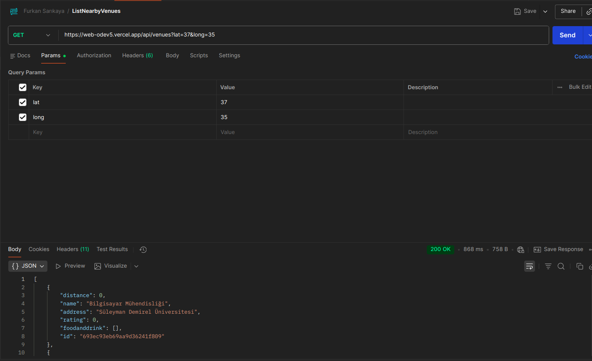
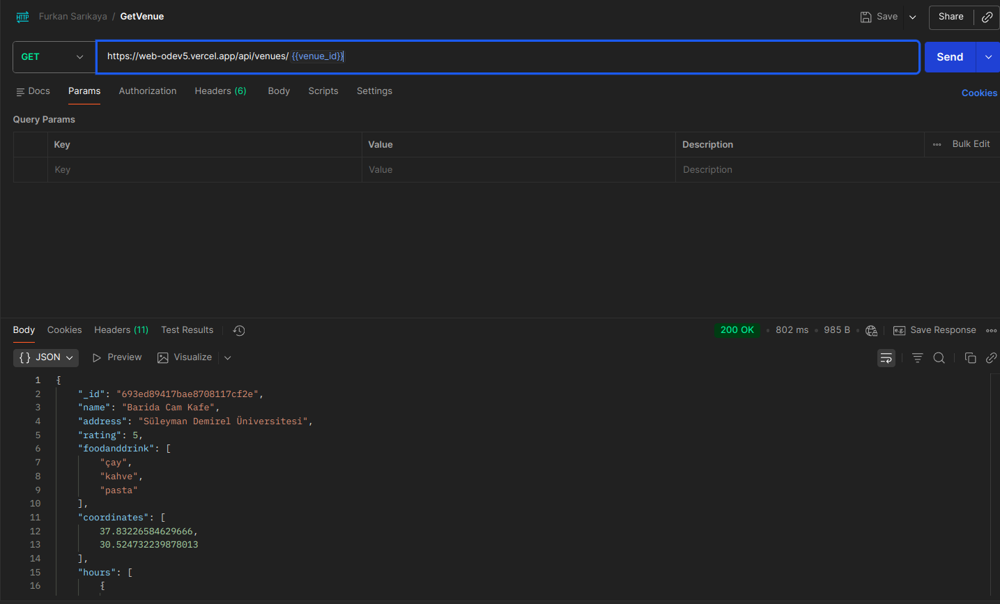
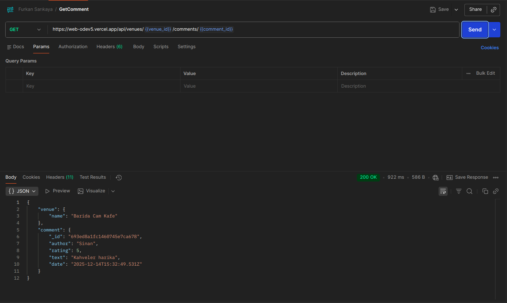
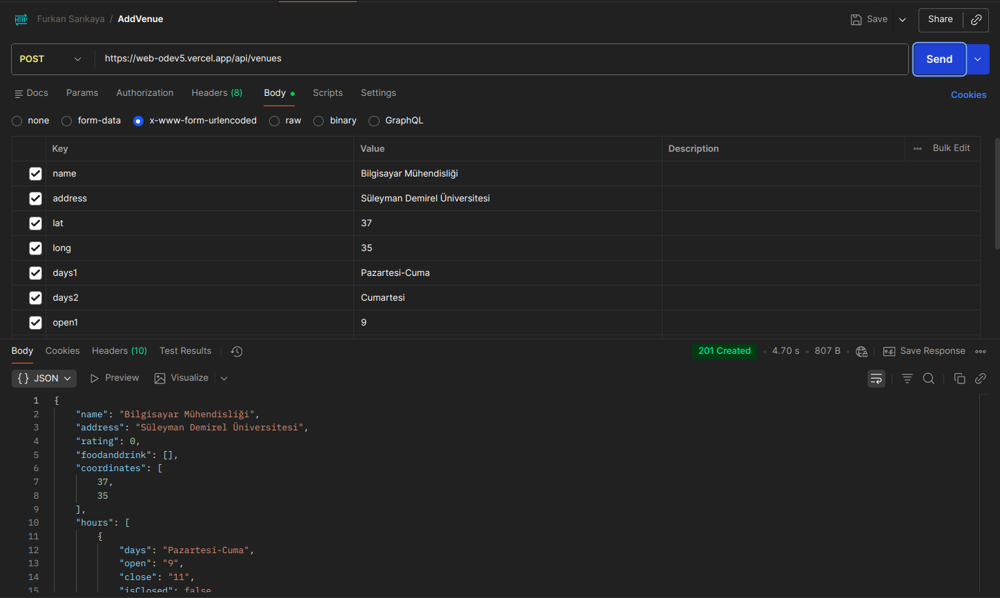
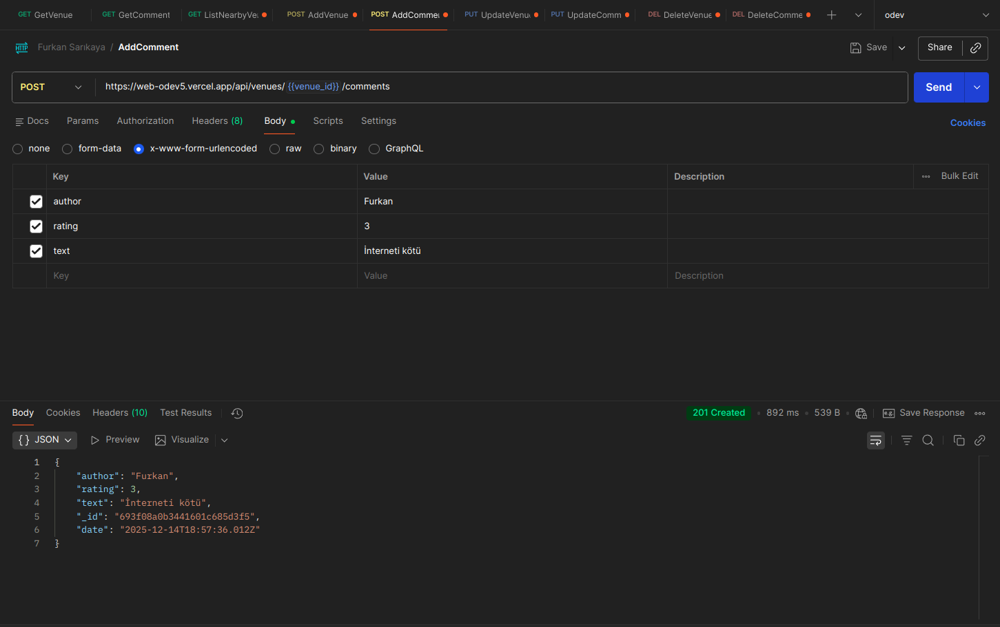
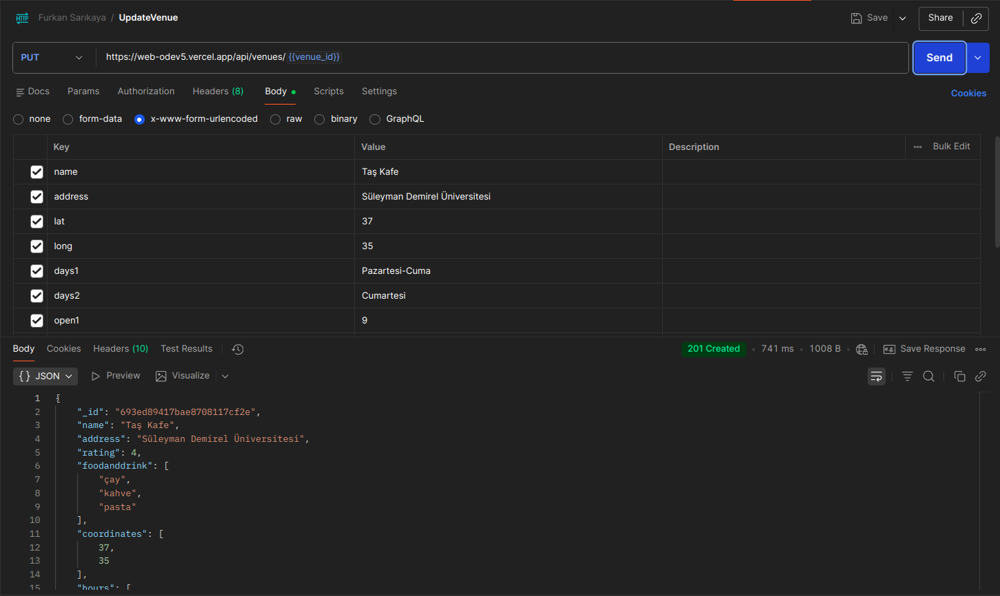
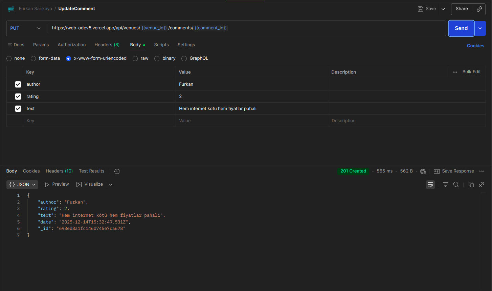
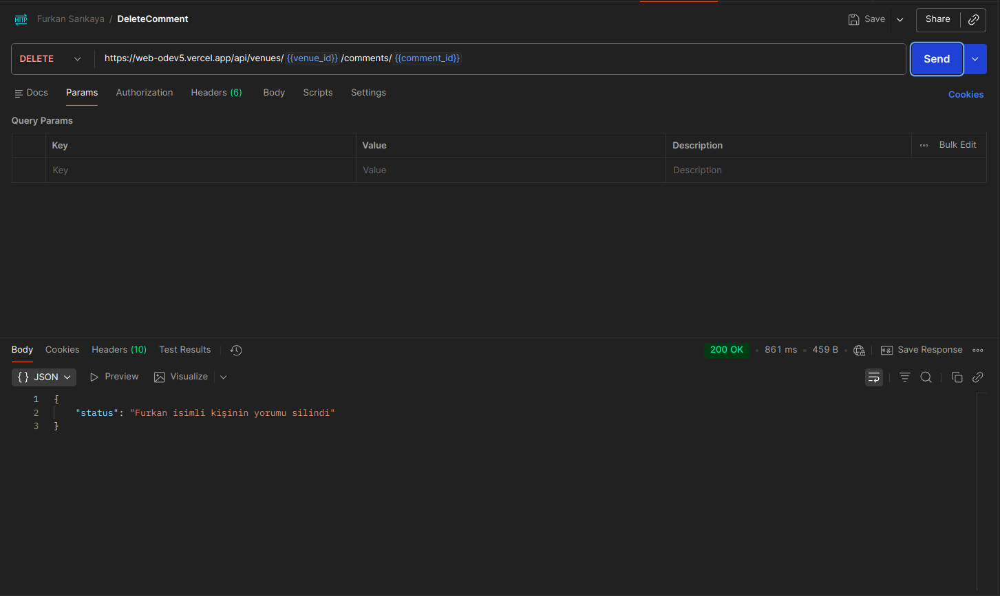
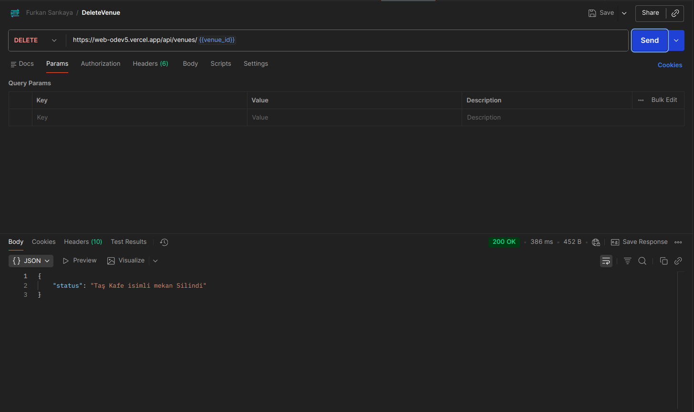

# Mekanbul Backend API

 **Canlı Demo :** [https://web-odev5.vercel.app](https://web-odev5.vercel.app)

## Test Ekran Görüntüleri (Postman)

Aşağıda API'nin çalıştığına dair Postman test sonuçları yer almaktadır:

### 1. Mekanları Listeleme (ListNearbyVenues)

### 2. Mekan Getirme (GetVenue)

### 3. Yorum Getirme (GetComment)

### 4. Mekan Ekleme (AddVenue)

### 5. Yorum Ekleme (AddComment)

### 6. Mekan Güncelleme (UpdateVenue)

### 7. Yorum Güncelleme (UpdateComment)

### 8. Yorum Silme (DeleteComment)

### 9. Mekan Silme (DeleteVenue)

